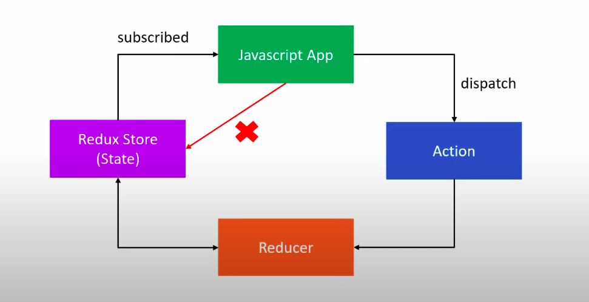

# retail-for-redux

Project to refresh redux concepts --- based on the v4 version of redux

NOTES:

1. Three important aspects : State, reducer, action
2. Three important principles :
   1. The entire state of the application is stored in the form of an object.
   2. The state cannot be changed directly. One must dispatch an action to manipulate the state.
   3. The state tree object can only be updated by the reducers. Reducers take previous state and action and return the new state.

3. Bind action creators: alternative to store dispatcher
